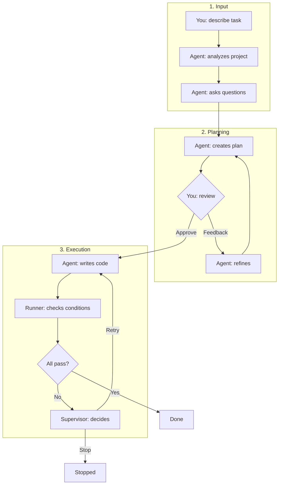

<div align="center">

# Proofloop

**Autonomous coding agent that works until your conditions are met**

[](https://www.python.org/downloads/)
[](LICENSE)
[](https://github.com/egorborisow/proofloop/actions/workflows/ci.yml)

*Define what "done" means. Walk away. Come back to verified results.*

</div>

---

## The Problem with AI Agents

<table>
<tr>
<td width="50%">

### ❌ Other agents

```diff
You: "Add multi-tenant to our SaaS:
      data isolation, subdomain routing,
      migrate existing users"

  Agent works...
  models, RLS policies, middleware...
- [Agent limit reached]

- "Done for now:
-  ├─ Models with tenant_id ✓
-  ├─ RLS policies ✓
-  └─ Remaining: routing, migration...
-  Continue later."

  *You come back later*

  You: "Continue, here's context..."
  Agent works...
- [Agent limit reached]

- "Progress:
-  ├─ Routing ✓
-  └─ Remaining: migration, testing..."

  *You come back...*
  ...repeat until "done"

  *Then you test and find bugs*
  *More sessions to fix them*
```

</td>
<td width="50%">

### ✅ Proofloop

```diff
You: "Add multi-tenant to our SaaS"

Conditions:
  - pytest passes
  - Tenant A can't see tenant B data
  - Redis cache isolated per tenant
  - Existing users migrated
  - Subdomain routing works

+ *You leave for the day* 🏠

+ Agent works... models, RLS
+ ✗ pytest: 2 failing → continue

+ Agent works... fixes RLS
+ ✗ isolation test failing → continue

+ Agent works... Redis, migration
+ ✗ cache test failing → continue

+ Agent works... fixes cache
+ ✓ All conditions pass

+ "Done. Evidence:"
+   ✓ pytest: 47 passed
+   ✓ isolation: verified
+   ✓ cache: isolated
+   ✓ migration: 1,204 users moved
```

</td>
</tr>
</table>

---

## Why Proofloop?

|   | Cursor | Claude Code | Aider | Proofloop |
|:--|:------:|:-----------:|:-----:|:---------:|
| **Mode** | Interactive | Interactive | Interactive | 🚀 Fire-and-forget |
| **Completion** | You decide | You decide | You decide | ✅ Conditions pass |
| **Verification** | Manual | Manual | Manual | 🔄 Automatic |
| **Verifier** | Same agent | Same agent | Same agent | 🔍 Runs actual commands |
| **Evidence** | — | — | — | 📋 Command output |
| **On failure** | You fix | You fix | You fix | 🔧 Auto-retry |

---

## Features

| Feature | Description |
|:--------|:------------|
| ✅ **Completion conditions** | Define what must pass: tests, linters, type checks, builds |
| 🚀 **Fire and forget** | Start a task, walk away, come back to verified results |
| 🔍 **Independent verification** | Conditions verified by running actual commands — agent can't lie |
| 🔄 **Smart retries** | Supervisor detects loops, stagnation, regressions |
| 🤖 **Multi-provider** | Claude, Codex (ChatGPT), or OpenCode — use your preferred AI |
| 📁 **Multi-repo** | Work across multiple repositories in one task |
| 🔬 **Research mode** | Gather information before coding *(beta)* |
| 🔌 **MCP integrations** | Connect to GitHub, Slack, Jira, databases |

## Quick Start

```bash
# 1. Install Proofloop
curl -fsSL https://raw.githubusercontent.com/egorborisow/proofloop/main/install.sh | bash

# 2. Setup provider (choose one)
claude login                    # Claude (default) - needs Anthropic account
# OR
npm i -g @openai/codex && codex # Codex - needs ChatGPT Plus/Pro
# OR
npm i -g opencode-ai && opencode # OpenCode - configure any provider

# 3. Run your first task
proofloop run "Add unit tests for the auth module" --path ./my-project
```

## Setup

### Step 1: Install Proofloop

```bash
# Quick Install (Recommended)
curl -fsSL https://raw.githubusercontent.com/egorborisow/proofloop/main/install.sh | bash

# Or from source
git clone https://github.com/egorborisow/proofloop.git && cd proofloop && make install

# Or via pipx
pipx install git+https://github.com/egorborisow/proofloop.git
```

**Requirements:** Python 3.11+, macOS or Linux

### Step 2: Configure AI Provider

Choose one provider and set it up. You can switch between providers using `--provider` flag.

| Provider | Subscription | Best For |
|----------|--------------|----------|
| **Claude** (default) | Anthropic account | Most reliable, recommended |
| **Codex** | ChatGPT Plus/Pro | If you have ChatGPT subscription |
| **OpenCode** | Any (configurable) | Flexibility, custom providers |

<details>
<summary><b>Claude Setup (Recommended)</b></summary>

```bash
# 1. Install Claude Code CLI
# Download from: https://claude.ai/download
# Or: npm i -g @anthropic-ai/claude-code

# 2. Login with your Anthropic account
claude login
```

</details>

<details>
<summary><b>Codex Setup (ChatGPT Plus/Pro)</b></summary>

```bash
# 1. Install Codex CLI
npm i -g @openai/codex

# 2. OAuth login - opens browser for ChatGPT auth
codex
```

Requires active ChatGPT Plus or Pro subscription.

</details>

<details>
<summary><b>OpenCode Setup</b></summary>

```bash
# 1. Install OpenCode
npm i -g opencode-ai@latest

# 2. Configure your provider (interactive setup)
opencode
```

OpenCode supports multiple backends: Claude, OpenAI, local models, etc.

</details>

### Step 3: Verify Setup

```bash
# Test with your configured provider
proofloop run "create hello.py that prints Hello World" --path /tmp/test

# Or specify provider explicitly
proofloop run "create hello.py" --path /tmp/test --provider claude
proofloop run "create hello.py" --path /tmp/test --provider codex
proofloop run "create hello.py" --path /tmp/test --provider opencode
```

## Usage

### Basic Task

```bash
proofloop run "Create a REST API for user management" --path ./my-project
```

### Choose Provider

```bash
# Use Claude (default)
proofloop run "Add tests" --path ./project --provider claude

# Use Codex (ChatGPT)
proofloop run "Add tests" --path ./project --provider codex

# Use OpenCode
proofloop run "Add tests" --path ./project --provider opencode
```

### Auto-Approve Mode

```bash
proofloop run "Refactor database layer" --path ./project --auto-approve
```

### Research Mode

```bash
proofloop run "Compare SQLAlchemy vs Tortoise ORM" --path ./research --research
```

### Multi-Repo

```bash
# Point to a folder containing multiple repos
proofloop run "Add /users endpoint to backend, UserList component to frontend" \
  --path ~/projects/my-feature
```

## CLI Reference

```
proofloop run [OPTIONS] DESCRIPTION

Options:
  -p, --path PATH          Project path (required)
  --provider PROVIDER      AI provider: claude, codex, opencode [default: claude]
  -y, --auto-approve       Skip approval prompts
  -t, --timeout MINUTES    Timeout [default: 60]
  -v, --verbose            Debug output
  --allow-mcp              Enable MCP servers
  --research               Research mode
```

### Other Commands

```bash
proofloop task list       # List tasks
proofloop task status     # Show task status
proofloop task resume     # Resume stopped task
proofloop mcp list        # Available MCP servers
proofloop mcp configure   # Configure MCP server
```

## How It Works



### The Flow

| Step | Who | What |
|------|-----|------|
| 1 | **You** | Describe what you want done |
| 2 | **Agent** | Analyzes project, discovers tests/lints/builds |
| 3 | **Agent** | Asks clarifying questions |
| 4 | **Agent** | Creates plan + conditions |
| 5 | **You** | Review: give feedback, edit conditions, or approve |
| 6 | **Agent** | Implements all code changes |
| 7 | **Runner** | Runs all condition checks |
| 8 | **Supervisor** | On failure: retry, rollback, or stop |
| 9 | - | **Done** when all conditions pass with evidence |

### Completion States

| State | Meaning |
|-------|---------|
| **DONE** | All conditions passed with evidence |
| **STOPPED** | Budget exhausted (use `proofloop task resume`) |
| **BLOCKED** | Needs your input |

See [How It Works](docs/how-it-works.md) for detailed architecture.

## Updating

```bash
cd ~/.proofloop  # or your install directory
make update
```

## Development

```bash
git clone https://github.com/egorborisow/proofloop.git
cd proofloop
make dev      # Install dev dependencies
make check    # Run all checks
make help     # Show all commands
```

## Documentation

- [Quick Start](docs/quickstart.md) — First task in 5 minutes
- [Usage Guide](docs/usage.md) — Examples and workflows
- [CLI Reference](docs/cli-reference.md) — All commands and options
- [How It Works](docs/how-it-works.md) — Pipeline architecture
- [MCP Servers](docs/mcp-servers.md) — External integrations
- [Installation](docs/installation.md) — Detailed setup guide

## Contributing

See [CONTRIBUTING.md](CONTRIBUTING.md) for guidelines.

## License

Apache 2.0 — see [LICENSE](LICENSE).
