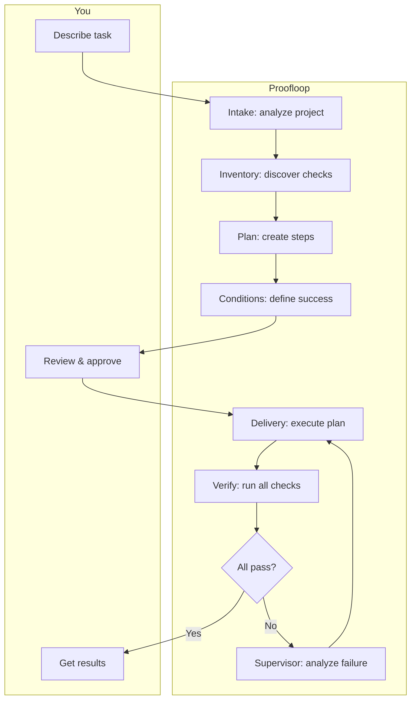

<p align="center">
  <h1 align="center">Proofloop</h1>
</p>

<p align="center">
  <b>Agents that run until done</b>
  <br>
  Define what "done" means. Go to sleep. Wake up to verified results.
</p>

<p align="center">
  <a href="https://www.python.org/downloads/"></a>
  <a href="LICENSE"></a>
  <a href="https://github.com/exiw-ai/proofloop/actions/workflows/ci.yml"></a>
  <a href="https://github.com/exiw-ai/proofloop/stargazers"></a>
</p>

---

## The Problem

<table>
<tr>
<td width="50%">

**Agents alone**

```diff
You: "Migrate our monolith to microservices"

  Agent works... extracts user service...
- [usage limit]

- "Progress: user-service extracted.
-  TODO: orders, payments, gateway..."

  *Next day*

  You: "Continue migration..."
  Agent works...
- [usage limit]

- "orders-service done.
-  TODO: payments, gateway, tests..."

  *This goes on for a week*
  *Then integration bugs everywhere*
```

</td>
<td width="50%">

**Proofloop**

```diff
You: "Migrate our monolith to microservices"

Conditions:
  - All services pass health checks
  - Integration tests green
  - Zero downtime deployment works
  - "Data consistency verified across services"

+ *You go to sleep*

+ Agent works... extracts services
+ ✗ integration tests fail → retry

+ Agent works... fixes contracts
+ ✗ deployment failing → retry

+ Agent works... 47 iterations later
+ ✓ All conditions pass

+ "Done. 8 hours."
```

</td>
</tr>
</table>

---

## Quickstart

**1. Install**

```bash
curl -LsSf https://raw.githubusercontent.com/exiw-ai/proofloop/main/install.sh | sh
```

**2. Setup provider** (choose one)

Proofloop orchestrates existing AI agents — install whichever you prefer:

<details>
<summary><b>OpenCode</b></summary>

```bash
npm i -g opencode-ai@latest
opencode  # Interactive setup
```

</details>

<details>
<summary><b>Codex</b> (ChatGPT Plus/Pro)</summary>

```bash
npm i -g @openai/codex
codex  # OAuth login
```

</details>

<details>
<summary><b>Claude Code</b></summary>

```bash
# Install: https://claude.com/download or npm i -g @anthropic-ai/claude-code
claude login
```

</details>

**3. Run**

```bash
proofloop run "Implement OAuth2 with Google, GitHub, and email/password auth" \
  --path ./my-project \
  --provider <provider>
```

Where `<provider>` is one of: `opencode`, `codex`, `claude`

---

## CLI

```
╭──────────────────────────────────────────────────────────────────────────────╮
│                                                                              │
│  proofloop - agents that run until done                                      │
│                                                                              │
│  Global Options:                                                             │
│    -v, --verbose    Enable verbose output                                    │
│    -V, --version    Show version and exit                                    │
│    --help           Show this help message                                   │
│                                                                              │
│  proofloop run <description> -p <path> --provider <provider>                 │
│    Run a coding task autonomously.                                           │
│                                                                              │
│    Required:                                                                 │
│      -p, --path PATH           Workspace path                                │
│      --provider NAME           Agent: claude, codex, opencode                │
│    Options:                                                                  │
│      -y, --auto-approve        Skip interactive approvals                    │
│      -t, --timeout HOURS       Timeout (default: 4)                          │
│                                                                              │
│  proofloop task list                                                         │
│    List all tasks.                                                           │
│                                                                              │
│  proofloop task status <task_id>                                             │
│    Show task status. Accepts full UUID or 4+ char prefix.                    │
│                                                                              │
│  proofloop task resume <task_id>                                             │
│    Resume a stopped task.                                                    │
│                                                                              │
│  Examples:                                                                   │
│    proofloop run "Migrate to microservices" -p ./backend --provider claude   │
│    proofloop run "Add multi-tenancy" -p . --provider codex                   │
│    proofloop task resume a1b2 --provider opencode                            │
│                                                                              │
╰──────────────────────────────────────────────────────────────────────────────╯
```

---

## Features

- **Completion conditions** — Automated (`pytest`, `mypy`, `make build`) or text-based ("API returns 200 for all endpoints")
- **No limits** — Runs for hours, handles 50+ iterations, retries failures automatically
- **Fire and forget** — Start before bed, wake up to verified results
- **Independent verification** — Conditions checked by running actual commands, not agent self-assessment
- **Smart supervisor** — Detects loops, stagnation, regressions; decides retry vs rollback vs stop
- **Multi-provider** — Uses OpenCode, Codex, or Claude Code under the hood
- **Multi-repo** — Coordinates changes across multiple repositories

---

## Usage Examples

### Full-stack feature with tests

```bash
proofloop run "Implement real-time notifications system with WebSocket server, \
  React hooks, PostgreSQL pub/sub, and comprehensive test coverage" \
  --path ./myapp \
  --provider <provider>
```

### Database migration

```bash
proofloop run "Migrate from MongoDB to PostgreSQL: schema design, \
  data migration scripts, update all repositories and services, \
  ensure zero data loss" \
  --path ./backend -t 8 \
  --provider <provider>
```

### Multi-repo refactoring

```bash
# ~/company/
# ├── api/        (Go backend)
# ├── web/        (React frontend)
# └── mobile/     (React Native)

proofloop run "Add end-to-end encryption for messages: \
  implement in API, update web and mobile clients, \
  add key rotation, write integration tests" \
  --path ~/company -t 6 \
  --provider <provider>
```

### Legacy modernization

```bash
proofloop run "Convert jQuery frontend to React: \
  component architecture, state management with Zustand, \
  preserve all existing functionality, add TypeScript" \
  --path ./legacy-app -t 10 \
  --provider <provider>
```

### Available providers

```bash
proofloop run "..." -p . --provider opencode  # OpenCode
proofloop run "..." -p . --provider codex     # Codex (ChatGPT)
proofloop run "..." -p . --provider claude    # Claude Code
```

### Task management

```bash
proofloop task list                            # List all tasks
proofloop task status 550e                     # Check status (short ID)
proofloop task resume 550e --provider claude   # Resume stopped task
```

---

## How It Works



| Phase | What happens |
|-------|--------------|
| **Intake** | Scans project structure, detects stack |
| **Inventory** | Discovers tests, linters, type checkers |
| **Plan** | Breaks task into implementation steps |
| **Conditions** | Defines success criteria (automated + text-based) |
| **You approve** | Review plan, adjust conditions, then approve |
| **Delivery** | Agent executes all steps |
| **Verify** | Runs every condition, collects evidence |
| **Supervisor** | On failure: analyzes, decides retry/rollback/stop |
| **Loop** | Repeats until all conditions pass or budget exhausted |

### Conditions

**Automated** — linked to commands:
- `pytest tests/` passes
- `make build` succeeds
- `mypy --strict` clean

**Text-based** — verified by agent each iteration:
- "API handles 1000 req/s under load test"
- "All UI components render without console errors"
- "Database queries use indexes, no full table scans"

---

## Docs

- **[Getting Started](docs/getting-started.md)** — Installation and first task
- **[User Guide](docs/guide.md)** — Workflows and features
- **[Reference](docs/reference.md)** — CLI commands and options

---

## Development

```bash
git clone https://github.com/exiw-ai/proofloop.git
cd proofloop
make dev      # Install dev dependencies
make check    # Run all checks
```

See [CONTRIBUTING.md](CONTRIBUTING.md) for guidelines.

---

## License

Apache 2.0 — see [LICENSE](LICENSE).
