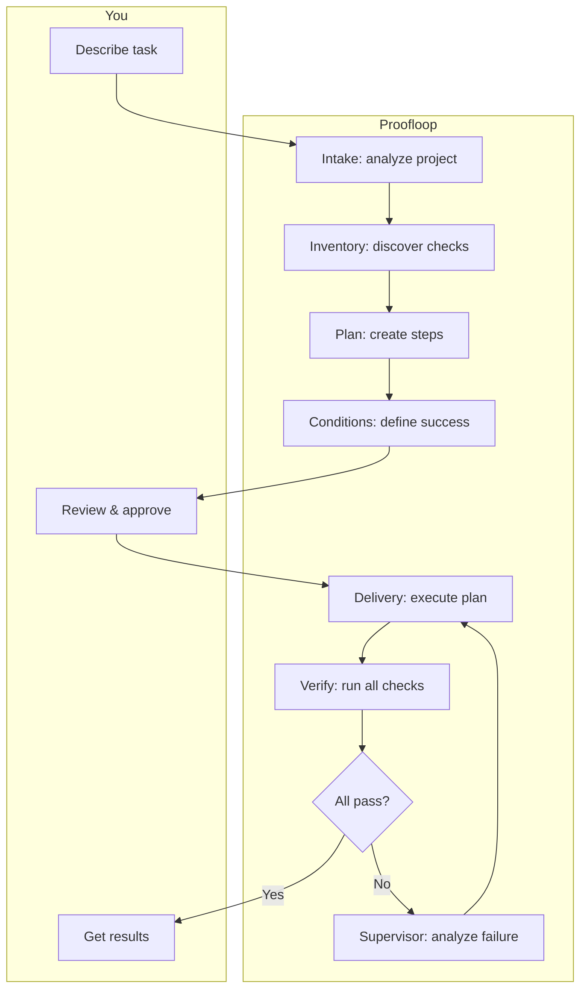

# User Guide

Detailed workflows and features for using Proofloop effectively.

## Task Workflow



### How It Works

1. **Intake** — Analyzes your project structure, detects language/framework/tooling
2. **Verification Inventory** — Discovers available checks (tests, linters, type checkers)
3. **Planning** — Creates step-by-step implementation plan
4. **Conditions** — Defines success criteria linked to actual commands
5. **Approval** — You review plan and conditions (skip with `-y`)
6. **Delivery** — Agent executes plan, runs all checks
7. **Supervisor** — Monitors progress, handles failures, retries intelligently
8. **Done** — All conditions pass with evidence

## Writing Good Task Descriptions

Be specific. The clearer your description, the better the results.

| Good | Bad |
|------|-----|
| "Add /users endpoint with GET and POST methods" | "Add API endpoint" |
| "Fix null pointer in parseConfig when config.yaml missing" | "Fix bug" |
| "Add pytest tests for auth module with 80% coverage" | "Add tests" |

## Auto-Approve Mode

Skip manual approval for fully autonomous operation:

```bash
proofloop run "Refactor database layer" --path ./project -y
```

Use when:
- You trust the task is well-defined
- Running overnight or unattended
- CI/CD automation

## Multi-Repository Tasks

Work across multiple repositories in a single task:

```bash
# Directory structure:
# ~/projects/my-feature/
# ├── backend/     (git repo)
# └── frontend/    (git repo)

proofloop run "Add /users endpoint to backend, UserList component to frontend" \
  --path ~/projects/my-feature
```

Proofloop automatically:
- Detects multiple git repositories
- Coordinates changes across repos
- Applies conditions to any repo
- Rolls back all repos together if needed

## Task Management

### List Tasks

```bash
proofloop task list
```

Shows all tasks with their IDs.

### Check Status

```bash
# Full UUID
proofloop task status 550e8400-e29b-41d4-a716-446655440000

# Short prefix (4+ chars)
proofloop task status 550e
```

Shows:
- Current state (running/stopped/done/blocked)
- Iteration count
- Conditions and their verification status

### Resume Stopped Task

```bash
proofloop task resume 550e
```

Continues from where it stopped. Useful after:
- Timeout
- Manual stop
- Budget exhaustion

## Pipeline Architecture

### Stages

| Stage | Description |
|-------|-------------|
| **Intake** | Parse task, scan project, detect tooling |
| **Inventory** | Discover tests, linters, type checkers, builds |
| **Plan** | Break task into steps, identify files |
| **Conditions** | Define objective success criteria |
| **Delivery** | Execute plan, run all checks |
| **Supervisor** | Monitor, detect issues, decide retry strategy |
| **Finalize** | Produce result with evidence |

### Condition Types

**Automated** (command-based):
- Test suites: `pytest`, `jest`, `go test`
- Linters: `ruff`, `eslint`, `golangci-lint`
- Type checkers: `mypy`, `tsc`
- Builds: `make build`, `npm run build`

**Manual** (agent-verified):
- UI/UX requirements
- Performance criteria
- Business logic verification

### Supervisor Intelligence

| Issue | Detection | Action |
|-------|-----------|--------|
| **Loop** | Same error 3+ times | Replan approach |
| **Stagnation** | No progress 3 iterations | Add context or replan |
| **Regression** | Passing check now fails | Replan approach |
| **Budget risk** | 80%+ iterations used | Early stop |
| **Flaky check** | Alternates PASS/FAIL | Block for review |

### Retry Strategies

- **Continue with context** — Retry with failure details
- **Rollback and retry** — Git stash all repos, fresh start
- **Stop** — Exit loop, finalize with current state

## Budgets and Limits

| Budget | Default | Description |
|--------|---------|-------------|
| Iterations | 50 | Max delivery retry cycles |
| Wall time | 10 hours | Maximum elapsed time |
| Stagnation | 3 | Max iterations without progress |
| Quality loops | 3 | Max quality review iterations |

When budget exhausted:
1. Task moves to STOPPED
2. Progress is saved
3. Use `proofloop task resume` to continue

## Evidence-Based Completion

Every condition produces evidence:

```
Condition: pytest tests/
Status: PASS
Evidence:
  ========================= test session starts =========================
  collected 15 items
  tests/test_auth.py::test_login PASSED
  tests/test_auth.py::test_logout PASSED
  ...
  ========================= 15 passed in 2.34s =========================
```

**Guarantees:**
- DONE = all blocking conditions have PASS with evidence
- No false positives — actual command output required
- Full audit trail of verification attempts

## Tips and Best Practices

1. **Be specific** — "Add pagination to /users with limit/offset" beats "improve the API"
2. **Use auto-approve** — Add `-y` for overnight runs
3. **Start small** — Test with simple tasks first
4. **Check status** — Use `proofloop task status` to monitor
5. **Resume if needed** — Stopped tasks can always be continued
6. **Trust the supervisor** — It handles retries and rollbacks automatically
