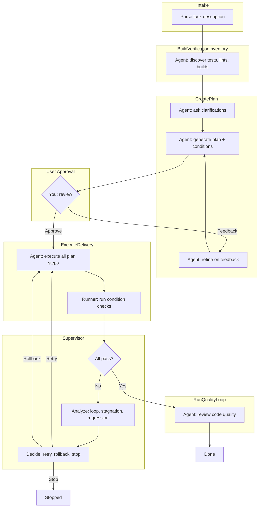
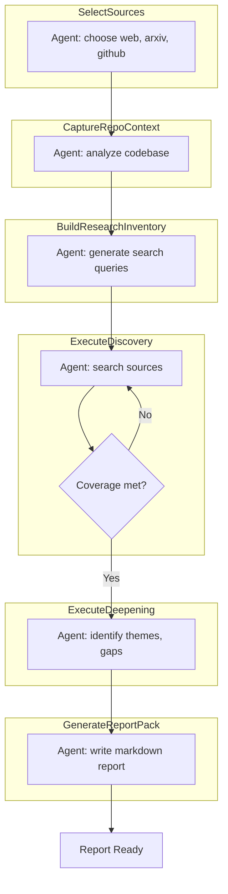

# How It Works

Understanding Proofloop's autonomous execution pipeline.

## Architecture

Proofloop uses a **single Claude Agent** with different roles at each pipeline stage. Each stage has a dedicated **Use Case** that configures the agent with specific prompts and allowed tools.

## Code Pipeline



## Pipeline Stages

### 1. Intake

Proofloop analyzes your task and project:

- Parses the task description
- Scans project structure
- Identifies relevant files and patterns
- Detects language, framework, and tooling

### 2. Verification Inventory

**Critical stage before any code changes:**

- Discovers all available checks in the project
- Identifies test suites, linters, type checkers, build commands
- Creates inventory of verification commands
- Ensures we know how to verify success before touching code

### 3. Planning

Creates a step-by-step implementation plan:

- Breaks task into concrete steps
- Identifies files to create/modify
- Plans test strategy
- Considers risks and assumptions

### 4. Conditions

Defines objective success criteria:

**Automated conditions** (linked to verification inventory):
- Test suites (`pytest`, `jest`, `go test`)
- Linters (`ruff`, `eslint`, `golangci-lint`)
- Type checkers (`mypy`, `tsc`)
- Build commands (`make build`, `npm run build`)

**Manual conditions** (agent-verified each iteration):
- UI/UX requirements
- Performance criteria
- Business logic verification

### 5. User Approval

Interactive approval loop:

- Review generated plan and conditions
- Approve to proceed, or reject with feedback
- Auto-approve mode (`-y`) skips this step
- Rejection without feedback → BLOCKED state

### 6. Delivery

Single agent call executes all plan steps:

- Agent receives complete plan
- Implements all steps in one cohesive session
- After completion, runs ALL blocking condition checks
- Records evidence for each condition

### 7. Supervisor

Intelligent monitoring and retry decisions:

| Anomaly | Detection | Action |
|---------|-----------|--------|
| **Loop** | Same error 3+ times | Replan approach |
| **Stagnation** | No progress 3 iterations | Add context or replan |
| **Regression** | Passing check now fails | Replan approach |
| **Budget risk** | 80%+ iterations used | Early stop |
| **Flaky check** | Alternates PASS/FAIL | Block for manual review |

**Retry strategies:**
- **Continue with context** — Retry with failure details
- **Rollback and retry** — Git stash all repos, fresh start
- **Stop** — Exit loop, finalize with current state

### 8. Quality Loop (Optional)

If enabled in strategy:

- Agent reviews code for quality issues
- Checks edge cases and potential problems
- Loops up to 3 times until "QUALITY_OK"

### 9. Finalize

Produces final result:

- Determines completion state (DONE/STOPPED/BLOCKED)
- Collects all evidence and condition outputs
- Generates summary and diff of changes

## Completion States

| State | Description | Next Action |
|-------|-------------|-------------|
| **DONE** | All blocking conditions passed with evidence | Task complete |
| **STOPPED** | Budget exhausted or supervisor stopped | `proofloop task resume` |
| **BLOCKED** | Needs user input or approval | Provide requested info |

## Budgets and Limits

Proofloop enforces multiple budgets to prevent runaway execution:

| Budget | Default | Description |
|--------|---------|-------------|
| Iterations | 50 | Max delivery retry cycles |
| Wall time | 10 hours | Maximum elapsed time |
| Stagnation | 3 | Max iterations without progress |
| Quality loops | 3 | Max quality review iterations |

When any budget is exhausted:
1. Task moves to STOPPED state
2. Progress is saved
3. Use `proofloop task resume` to continue

## Evidence-Based Completion

Every condition check produces evidence:

```
Condition: pytest tests/
Status: PASS
Evidence:
  ========================= test session starts =========================
  collected 15 items
  tests/test_auth.py::test_login PASSED
  tests/test_auth.py::test_logout PASSED
  ...
  ========================= 15 passed in 2.34s =========================
```

**Contract guarantees:**
- DONE = all blocking conditions have PASS with evidence
- No false positives — actual command output required
- Audit trail of all verification attempts

## Manual Condition Verification

For manual conditions (no automated check):

1. Agent analyzes relevant code/changes
2. Makes tool calls to verify
3. Produces verdict with reasoning
4. Re-verified on EVERY iteration until PASS

This ensures manual requirements aren't forgotten during retries.

## Multi-Repository Support

When `--path` points to a directory containing multiple git repositories:

1. Each repo is detected automatically
2. Changes are coordinated across repos
3. Conditions can reference any repo
4. Rollback stashes all repos together

## Research Pipeline *(Beta)*

With `--research` flag, a separate pipeline runs for information gathering:



**Key differences from Code Pipeline:**
- No code modifications allowed
- Agent focuses on gathering and synthesizing information
- Output is a structured markdown report with citations
